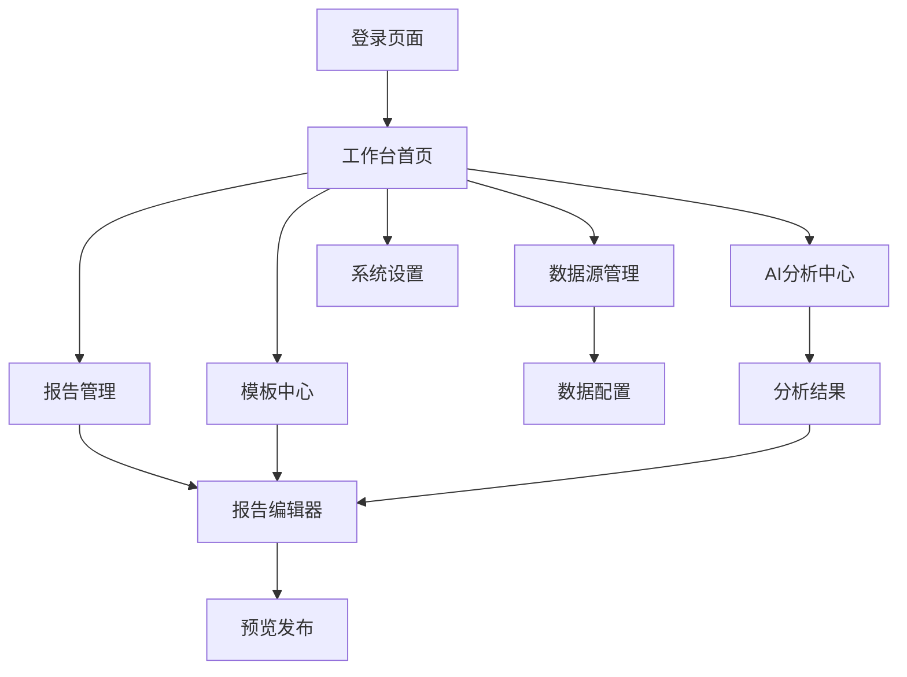

# 智能报告生成系统产品需求文档

## 1. 产品概述

智能报告生成系统是一个面向国家电网营销业务的自动化、智能化报告生成与分析平台。系统通过AI技术和自动化流程，将传统的手工报告编制模式转变为智能化的数据驱动报告生成，实现从数据获取、计算分析到报告输出的全流程自动化。

核心解决问题：消除数据获取壁垒、提升报告编制效率、增强数据分析洞察能力，服务于营销业务人员和管理决策层。

目标市场价值：将报告生成周期从"人天级"压缩至"分钟级"，释放80%以上的人力资源投入到高价值分析决策工作中。

## 2. 核心功能

### 2.1 用户角色

| 角色    | 注册方式    | 核心权限                   |
| ----- | ------- | ---------------------- |
| 系统管理员 | 内部分配账号  | 系统配置、用户管理、数据源管理、模板管理   |
| 业务分析师 | 邮箱注册+审批 | 报告创建、编辑、发布、数据分析、AI辅助功能 |
| 数据运维员 | 内部分配账号  | 数据源配置、数据接入、计算引擎配置      |
| 普通用户  | 邮箱注册    | 查看报告、基础编辑、模板使用         |
| 管理决策层 | 内部分配账号  | 查看所有报告、决策分析、数据洞察       |

### 2.2 功能模块

系统包含以下核心页面：

1. **登录注册页面**：用户身份验证、权限分配
2. **工作台首页**：个人工作概览、快速操作入口、数据大屏
3. **报告管理页面**：报告列表、分类管理、搜索筛选
4. **报告编辑器**：富文本编辑、图表插入、数据绑定、AI辅助
5. **模板中心**：模板库管理、自定义模板、模板预览
6. **数据源管理**：数据接入配置、数据预览、连接测试
7. **AI分析中心**：智能分析、异常预警、趋势洞察
8. **系统设置**：用户管理、权限配置、系统参数

### 2.3 页面详情

| 页面名称   | 模块名称   | 功能描述                      |
| ------ | ------ | ------------------------- |
| 登录注册页面 | 用户认证   | 支持邮箱登录、SSO集成、密码重置、记住登录状态  |
| 工作台首页  | 数据概览   | 显示个人报告统计、待办事项、系统通知、快速创建入口 |
| 工作台首页  | 快速操作   | 新建报告、导入模板、数据源连接、AI分析启动    |
| 报告管理页面 | 报告列表   | 分页展示、多维筛选、批量操作、状态管理       |
| 报告管理页面 | 分类管理   | 自定义分类、标签系统、收藏夹、共享设置       |
| 报告编辑器  | 富文本编辑  | 类WPS编辑体验、格式工具栏、样式模板、实时保存  |
| 报告编辑器  | 图表系统   | 多类型图表、数据绑定、交互配置、样式自定义     |
| 报告编辑器  | AI辅助功能 | AI写作、智能校对、内容优化、数据解读       |
| 模板中心   | 模板库    | 内置模板、行业模板、自定义模板、版本管理      |
| 模板中心   | 模板编辑   | 可视化设计、组件拖拽、数据占位符、预览功能     |
| 数据源管理  | 连接配置   | 数据库连接、API接口、文件上传、连接测试     |
| 数据源管理  | 数据预览   | 数据表结构、数据采样、字段映射、数据质量检查    |
| AI分析中心 | 智能分析   | 趋势分析、异常检测、关联分析、预测建模       |
| AI分析中心 | 洞察报告   | 自动生成分析结论、业务建议、风险预警        |
| 系统设置   | 用户管理   | 用户列表、角色分配、权限矩阵、审批流程       |
| 系统设置   | 系统配置   | 参数设置、集成配置、安全策略、日志管理       |

## 3. 核心流程

### 3.1 报告创建流程

用户登录系统后，可通过以下流程创建报告：

1. 选择报告模板或创建空白报告
2. 配置数据源和数据绑定
3. 使用富文本编辑器编写内容
4. 插入图表和数据可视化元素
5. 使用AI辅助功能优化内容
6. 预览和发布报告

### 3.2 数据分析流程

业务分析师进行数据分析的典型流程：

1. 连接和配置数据源
2. 导入或选择分析数据
3. 使用AI分析工具进行智能分析
4. 查看分析结果和洞察建议
5. 生成分析报告
6. 分享和协作

### 3.3 页面导航流程图

## 4. 用户界面设计

### 4.1 设计风格

* **主色调**：深蓝色(#1890FF)作为主色，浅蓝色(#E6F7FF)作为辅助色

* **按钮样式**：圆角矩形按钮，主按钮采用渐变效果，次要按钮为线框样式

* **字体规范**：中文使用"PingFang SC"，英文使用"Roboto"，标题16-24px，正文14px，说明文字12px

* **布局风格**：卡片式布局，左侧导航+主内容区域，响应式设计

* **图标风格**：线性图标风格，统一使用Ant Design图标库

* **动效设计**：微动效增强交互体验，页面切换使用淡入淡出效果

### 4.2 页面设计概览

| 页面名称   | 模块名称 | UI元素                                     |
| ------ | ---- | ---------------------------------------- |
| 登录页面   | 登录表单 | 居中卡片布局，品牌Logo，输入框采用圆角设计，主按钮渐变蓝色，背景使用几何图案 |
| 工作台首页  | 导航栏  | 顶部固定导航，Logo+用户头像，面包屑导航，通知中心图标            |
| 工作台首页  | 数据卡片 | 4列网格布局，数据卡片包含图标、数值、趋势图，悬停效果              |
| 工作台首页  | 快速操作 | 大按钮网格，图标+文字，鼠标悬停放大效果                     |
| 报告管理   | 列表视图 | 表格布局，支持排序筛选，操作按钮组，状态标签，分页组件              |
| 报告编辑器  | 工具栏  | 顶部固定工具栏，分组按钮，下拉菜单，颜色选择器                  |
| 报告编辑器  | 编辑区域 | 中央编辑画布，左侧组件面板，右侧属性面板，底部状态栏               |
| 模板中心   | 模板网格 | 卡片网格布局，模板缩略图，标签系统，搜索筛选栏                  |
| AI分析中心 | 分析面板 | 左右分栏布局，左侧配置面板，右侧结果展示，图表可视化               |

### 4.3 响应式设计

系统采用桌面优先的响应式设计策略：

* **桌面端(≥1200px)**：完整功能布局，三栏式设计

* **平板端(768px-1199px)**：自适应布局，侧边栏可收缩

* **移动端(<768px)**：单栏布局，底部导航，触摸优化

* **交互优化**：支持触摸手势，拖拽操作，键盘快捷键

## 5. 技术需求

### 5.1 性能要求

* 页面加载时间 < 3秒

* 报告生成时间 < 30秒

* 支持并发用户数 > 1000

* 数据实时同步延迟 < 1秒

### 5.2 安全要求

* 用户身份认证和授权

* 数据传输加密(HTTPS)

* 敏感数据脱敏处理

* 操作日志审计

### 5.3 兼容性要求

* 支持Chrome、Firefox、Safari、Edge浏览器

* 兼容Windows、macOS、Linux操作系统

* 支持移动端浏览器访问

## 6. 数据需求

### 6.1 数据源支持

* 关系型数据库(MySQL、PostgreSQL、Oracle)

* 数据仓库(ClickHouse、Snowflake)

* API接口(REST、GraphQL)

* 文件格式(Excel、CSV、JSON)

* 实时数据流(Kafka、WebSocket)

### 6.2 数据处理

* 数据清洗和预处理

* 数据计算和聚合

* 数据缓存和优化

* 数据血缘和质量监控

