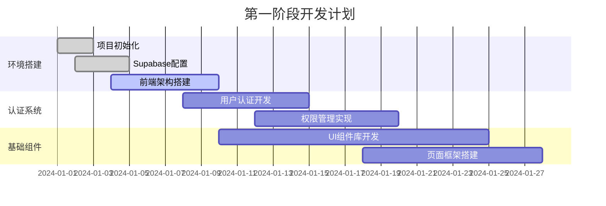
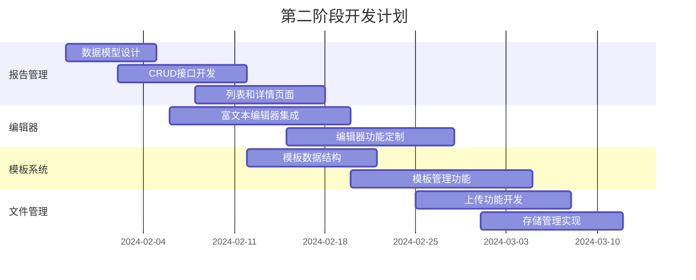
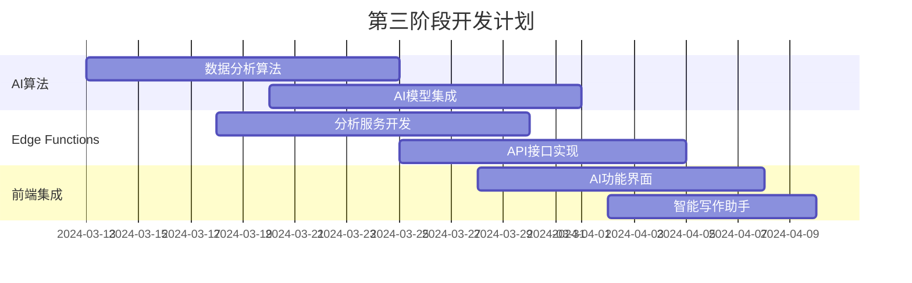

# 智能报告生成系统开发实施计划

## 1. 项目概述

### 1.1 项目目标
基于现有的智能报告系统文档，开发一套现代化的智能报告生成平台，实现：
- 自动化报告生成，提升80%的工作效率
- AI辅助数据分析和内容优化
- 多用户实时协作编辑
- 丰富的模板库和可视化组件
- 企业级安全和权限管理

### 1.2 技术选型
- **前端**: React 18 + TypeScript + Vite + Ant Design + Tailwind CSS
- **后端**: Supabase (PostgreSQL + Auth + Storage + Realtime + Edge Functions)
- **部署**: Vercel (前端) + Supabase Cloud (后端)
- **监控**: Sentry + Vercel Analytics
- **AI服务**: OpenAI GPT-4 + 自研数据分析算法

### 1.3 项目范围
- 用户认证和权限管理系统
- 报告创建、编辑、管理功能
- 模板中心和组件库
- AI智能分析和内容生成
- 实时协作和版本控制
- 数据可视化和图表生成
- 文件上传和存储管理
- 移动端适配和响应式设计

## 2. 项目团队组织

### 2.1 团队结构

| 角色 | 人数 | 主要职责 |
|------|------|----------|
| 项目经理 | 1 | 项目整体规划、进度管控、风险管理 |
| 产品经理 | 1 | 需求分析、产品设计、用户体验优化 |
| UI/UX设计师 | 1 | 界面设计、交互设计、视觉规范 |
| 前端开发工程师 | 2 | React应用开发、组件库建设 |
| 后端开发工程师 | 1 | Supabase配置、Edge Functions开发 |
| AI算法工程师 | 1 | AI分析算法、数据处理逻辑 |
| 测试工程师 | 1 | 功能测试、性能测试、自动化测试 |
| DevOps工程师 | 1 | 部署配置、监控告警、CI/CD |

### 2.2 沟通机制
- **日常沟通**: 每日站会（15分钟）
- **周例会**: 每周进度回顾和计划调整（1小时）
- **月度评审**: 里程碑评审和质量检查（2小时）
- **紧急沟通**: Slack/企业微信即时响应
- **文档协作**: Notion/飞书文档实时协作

## 3. 开发阶段规划

### 3.1 第一阶段：基础架构搭建（4周）

**目标**: 完成项目基础架构和核心功能框架

**主要任务**:
- 项目初始化和开发环境搭建
- Supabase项目配置和数据库设计
- 前端项目架构和基础组件开发
- 用户认证系统实现
- 基础路由和页面框架

**交付物**:
- 完整的开发环境和部署流程
- 用户注册、登录、权限管理功能
- 基础UI组件库和设计系统
- 项目架构文档和开发规范

**时间安排**:

### 3.2 第二阶段：核心功能开发（6周）

**目标**: 实现报告管理和编辑的核心功能

**主要任务**:
- 报告CRUD操作和数据管理
- 富文本编辑器集成和定制
- 模板系统设计和实现
- 文件上传和存储功能
- 基础数据可视化组件

**交付物**:
- 完整的报告管理系统
- 功能丰富的报告编辑器
- 模板创建和使用功能
- 文件管理和存储系统
- 基础图表和可视化组件

**时间安排**:

### 3.3 第三阶段：AI功能集成（4周）

**目标**: 集成AI分析和智能内容生成功能

**主要任务**:
- AI分析算法开发和集成
- Edge Functions实现
- 智能内容生成功能
- 数据分析和可视化增强
- AI辅助写作和优化

**交付物**:
- AI数据分析功能
- 智能内容生成和优化
- 增强的数据可视化
- AI辅助决策支持

**时间安排**:

### 3.4 第四阶段：协作和高级功能（4周）

**目标**: 实现实时协作和高级功能特性

**主要任务**:
- 实时协作功能开发
- 版本控制和历史记录
- 高级权限和审批流程
- 性能优化和缓存策略
- 移动端适配

**交付物**:
- 多用户实时协作功能
- 完整的版本控制系统
- 企业级权限管理
- 优化的性能表现
- 移动端友好界面

### 3.5 第五阶段：测试和优化（3周）

**目标**: 全面测试和性能优化

**主要任务**:
- 功能测试和集成测试
- 性能测试和优化
- 安全测试和漏洞修复
- 用户体验优化
- 文档完善和培训准备

**交付物**:
- 完整的测试报告
- 性能优化方案
- 安全评估报告
- 用户手册和培训材料

### 3.6 第六阶段：部署和上线（2周）

**目标**: 生产环境部署和正式上线

**主要任务**:
- 生产环境配置和部署
- 数据迁移和初始化
- 监控和告警配置
- 用户培训和支持
- 上线后问题跟踪

**交付物**:
- 稳定运行的生产系统
- 完整的监控和告警体系
- 用户培训和支持文档
- 上线报告和后续计划

## 4. 详细开发计划

### 4.1 技术实现路线图

**前端开发路线**:
1. **基础架构** (Week 1-2)
   - Vite + React + TypeScript项目搭建
   - 路由配置和页面结构
   - Ant Design主题定制
   - Tailwind CSS集成

2. **状态管理** (Week 2-3)
   - Zustand状态管理配置
   - 认证状态管理
   - 报告数据状态管理
   - 实时协作状态管理

3. **组件开发** (Week 3-6)
   - 基础UI组件封装
   - 业务组件开发
   - 图表组件集成
   - 编辑器组件定制

4. **功能集成** (Week 7-12)
   - API服务层开发
   - 实时功能集成
   - AI功能界面
   - 文件上传组件

**后端开发路线**:
1. **数据库设计** (Week 1-2)
   - 表结构设计和创建
   - 索引和约束配置
   - RLS安全策略
   - 初始数据准备

2. **认证系统** (Week 2-3)
   - Supabase Auth配置
   - 用户角色和权限
   - 社交登录集成
   - 密码策略配置

3. **存储配置** (Week 3-4)
   - 存储桶创建和配置
   - 文件上传策略
   - 图片处理和优化
   - CDN配置

4. **Edge Functions** (Week 8-12)
   - AI分析服务
   - 数据处理函数
   - 第三方API集成
   - 定时任务配置

### 4.2 关键里程碑

| 里程碑 | 时间节点 | 主要交付物 | 验收标准 |
|--------|----------|------------|----------|
| M1: 基础架构完成 | Week 4 | 认证系统、基础页面 | 用户可以注册登录，访问主要页面 |
| M2: 核心功能完成 | Week 10 | 报告管理、编辑器 | 用户可以创建、编辑、保存报告 |
| M3: AI功能集成 | Week 14 | AI分析、智能生成 | AI功能正常工作，提供有价值的分析 |
| M4: 协作功能完成 | Week 18 | 实时协作、版本控制 | 多用户可以同时编辑，版本管理正常 |
| M5: 测试完成 | Week 21 | 测试报告、优化方案 | 所有功能测试通过，性能达标 |
| M6: 正式上线 | Week 23 | 生产系统、用户培训 | 系统稳定运行，用户可以正常使用 |

### 4.3 风险管控

**技术风险**:
1. **AI服务稳定性**
   - 风险：第三方AI服务不稳定或限流
   - 应对：多服务商备选方案，本地算法备份
   - 责任人：AI算法工程师

2. **实时协作复杂性**
   - 风险：多用户协作冲突处理复杂
   - 应对：采用成熟的协作算法，充分测试
   - 责任人：前端开发工程师

3. **性能瓶颈**
   - 风险：大量数据处理导致性能问题
   - 应对：分页加载，缓存策略，CDN加速
   - 责任人：全栈工程师

**项目风险**:
1. **需求变更**
   - 风险：客户需求频繁变更影响进度
   - 应对：需求冻结机制，变更评估流程
   - 责任人：项目经理

2. **人员流动**
   - 风险：关键人员离职影响项目进度
   - 应对：知识文档化，交叉培训
   - 责任人：项目经理

3. **第三方依赖**
   - 风险：Supabase服务变更或故障
   - 应对：备选方案准备，数据备份策略
   - 责任人：DevOps工程师

## 5. 质量保证计划

### 5.1 代码质量标准

**代码规范**:
- TypeScript严格模式
- ESLint + Prettier代码格式化
- 组件和函数命名规范
- 注释和文档要求
- Git提交信息规范

**代码审查流程**:
1. 开发者自测和自审
2. 同级工程师代码审查
3. 技术负责人最终审查
4. 自动化测试通过
5. 合并到主分支

**测试覆盖率要求**:
- 单元测试覆盖率 ≥ 80%
- 集成测试覆盖核心业务流程
- E2E测试覆盖主要用户场景
- 性能测试验证关键指标

### 5.2 测试策略

**测试类型和工具**:
- **单元测试**: Jest + React Testing Library
- **集成测试**: Supertest + Jest
- **E2E测试**: Playwright
- **性能测试**: Lighthouse + WebPageTest
- **安全测试**: OWASP ZAP + Snyk

**测试环境**:
- **开发环境**: 本地开发测试
- **测试环境**: 自动化测试和手工测试
- **预生产环境**: 生产数据模拟测试
- **生产环境**: 监控和告警

### 5.3 性能指标

**前端性能指标**:
- 首屏加载时间 < 2秒
- 页面切换响应时间 < 500ms
- 编辑器操作响应时间 < 100ms
- Lighthouse性能评分 > 90

**后端性能指标**:
- API响应时间 < 200ms
- 数据库查询时间 < 100ms
- 文件上传速度 > 1MB/s
- 并发用户数 > 1000

**系统可用性指标**:
- 系统可用性 > 99.9%
- 错误率 < 0.1%
- 平均故障恢复时间 < 30分钟

## 6. 资源配置和预算

### 6.1 人力资源配置

**开发团队成本** (23周):
- 项目经理: ¥25,000/月 × 6月 = ¥150,000
- 产品经理: ¥20,000/月 × 6月 = ¥120,000
- UI/UX设计师: ¥18,000/月 × 4月 = ¥72,000
- 前端工程师 × 2: ¥22,000/月 × 6月 × 2 = ¥264,000
- 后端工程师: ¥24,000/月 × 6月 = ¥144,000
- AI算法工程师: ¥28,000/月 × 4月 = ¥112,000
- 测试工程师: ¥16,000/月 × 3月 = ¥48,000
- DevOps工程师: ¥20,000/月 × 2月 = ¥40,000

**人力成本小计**: ¥950,000

### 6.2 技术服务成本

**云服务和工具**:
- Supabase Pro: $25/月 × 12月 = $300
- Vercel Pro: $20/月 × 12月 = $240
- OpenAI API: $500/月 × 12月 = $6,000
- Sentry监控: $26/月 × 12月 = $312
- 其他工具和服务: $200/月 × 12月 = $2,400

**技术服务成本小计**: $9,252 (约¥65,000)

### 6.3 设备和办公成本

**开发设备**:
- MacBook Pro × 8台: ¥15,000 × 8 = ¥120,000
- 显示器和配件: ¥3,000 × 8 = ¥24,000
- 办公场地租赁: ¥8,000/月 × 6月 = ¥48,000
- 其他办公用品: ¥10,000

**设备办公成本小计**: ¥202,000

### 6.4 总预算

| 成本类别 | 金额 | 占比 |
|----------|------|------|
| 人力成本 | ¥950,000 | 78% |
| 技术服务 | ¥65,000 | 5% |
| 设备办公 | ¥202,000 | 17% |
| **总计** | **¥1,217,000** | **100%** |

**预算分配建议**:
- 预留10%的风险缓冲资金: ¥121,700
- **项目总预算**: ¥1,338,700

## 7. 上线和运维计划

### 7.1 部署策略

**分阶段部署**:
1. **内测版本** (Week 20)
   - 内部团队测试
   - 核心功能验证
   - 性能基准测试

2. **Beta版本** (Week 21)
   - 邀请用户测试
   - 收集反馈和优化
   - 压力测试和调优

3. **正式版本** (Week 23)
   - 全量用户发布
   - 监控和告警
   - 用户支持和培训

**部署环境配置**:
- **生产环境**: Vercel + Supabase Cloud
- **CDN加速**: Vercel Edge Network
- **数据备份**: 每日自动备份
- **监控告警**: Sentry + Vercel Analytics

### 7.2 运维监控

**监控指标**:
- 系统性能指标
- 用户行为数据
- 错误和异常监控
- 业务关键指标

**告警机制**:
- 系统故障自动告警
- 性能异常预警
- 安全事件通知
- 业务指标异常提醒

**运维响应**:
- 7×24小时监控
- 故障响应时间 < 15分钟
- 问题解决时间 < 2小时
- 定期巡检和优化

### 7.3 用户支持

**支持渠道**:
- 在线帮助文档
- 视频教程和演示
- 客服聊天支持
- 邮件技术支持
- 电话紧急支持

**培训计划**:
- 管理员培训 (2天)
- 普通用户培训 (1天)
- 在线培训视频
- 操作手册和FAQ

## 8. 项目成功标准

### 8.1 技术指标
- 系统稳定性 > 99.9%
- 页面加载速度 < 2秒
- API响应时间 < 200ms
- 移动端适配完成度 100%
- 安全漏洞数量 = 0

### 8.2 业务指标
- 用户注册转化率 > 60%
- 报告创建成功率 > 95%
- 用户活跃度 > 70%
- 客户满意度 > 4.5/5
- 功能使用覆盖率 > 80%

### 8.3 项目管理指标
- 按时交付率 100%
- 预算控制偏差 < 10%
- 质量缺陷率 < 2%
- 团队满意度 > 4.0/5
- 文档完整度 100%

## 9. 后续发展规划

### 9.1 版本迭代计划

**V1.1 (上线后3个月)**:
- 用户反馈优化
- 性能调优
- 新增图表类型
- 移动端功能增强

**V1.2 (上线后6个月)**:
- 高级AI功能
- 企业级集成
- 多语言支持
- 高级权限管理

**V2.0 (上线后12个月)**:
- 大数据分析
- 机器学习模型
- 开放API平台
- 生态系统建设

### 9.2 技术演进方向
- 微服务架构升级
- 容器化部署
- 边缘计算优化
- AI能力增强
- 数据湖集成

### 9.3 商业化路径
- 免费版本获客
- 付费功能增值
- 企业版本定制
- API服务收费
- 生态合作分成

## 10. 总结

本开发实施计划为智能报告生成系统提供了完整的开发路线图，涵盖了从项目启动到正式上线的全过程。通过科学的项目管理、合理的资源配置和严格的质量控制，确保项目能够按时、按质、按预算完成交付。

**关键成功因素**:
1. **技术选型合理**: 基于成熟的技术栈，降低开发风险
2. **团队配置完整**: 涵盖所有必要的技术角色
3. **计划安排科学**: 分阶段推进，里程碑明确
4. **质量保证严格**: 多层次测试，持续集成
5. **风险管控到位**: 识别风险，制定应对策略

通过执行这个实施计划，我们将交付一个功能完整、性能优异、用户体验良好的智能报告生成系统，为用户提供高效的报告创建和数据分析能力。