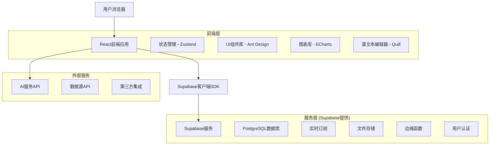
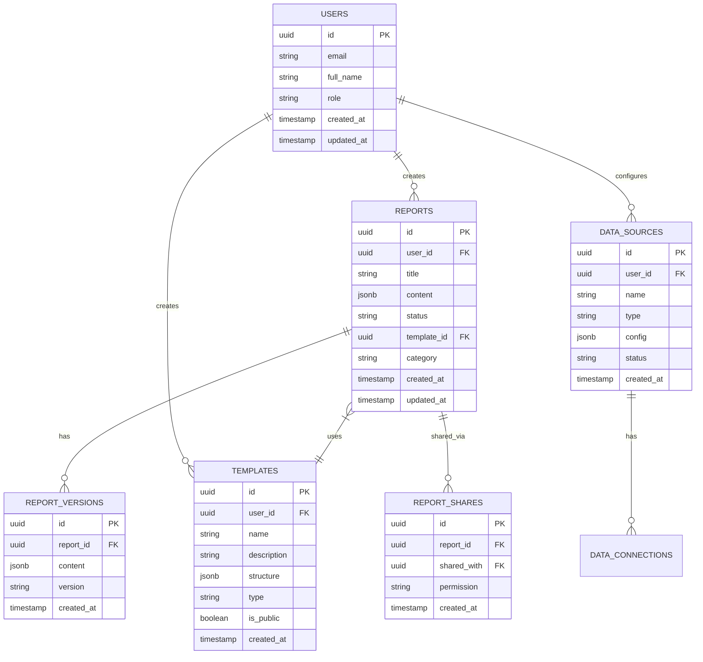

# 智能报告生成系统技术架构文档

## 1. 架构设计



## 2. 技术描述

* **前端**: React\@18 + TypeScript + Vite + Ant Design + TailwindCSS

* **后端**: Supabase (PostgreSQL + 实时API + 认证 + 存储)

* **状态管理**: Zustand

* **图表可视化**: ECharts + D3.js

* **富文本编辑**: Quill.js

* **AI集成**: OpenAI API / 百度文心一言 API

## 3. 路由定义

| 路由             | 用途                |
| -------------- | ----------------- |
| /              | 首页重定向到工作台         |
| /login         | 用户登录页面            |
| /register      | 用户注册页面            |
| /dashboard     | 工作台首页，显示数据概览和快速操作 |
| /reports       | 报告管理页面，报告列表和分类管理  |
| /reports/:id   | 报告详情页面            |
| /editor/:id?   | 报告编辑器，支持新建和编辑     |
| /templates     | 模板中心，模板库和自定义模板    |
| /templates/:id | 模板详情和预览           |
| /datasources   | 数据源管理，连接配置和数据预览   |
| /analytics     | AI分析中心，智能分析和洞察    |
| /settings      | 系统设置，用户管理和系统配置    |
| /profile       | 个人资料设置            |

## 4. API定义

### 4.1 用户认证相关

**用户注册**

```
POST /auth/signup
```

请求参数:

| 参数名        | 参数类型   | 是否必需  | 描述           |
| ---------- | ------ | ----- | ------------ |
| email      | string | true  | 用户邮箱         |
| password   | string | true  | 用户密码         |
| full\_name | string | true  | 用户姓名         |
| role       | string | false | 用户角色，默认为普通用户 |

响应参数:

| 参数名     | 参数类型   | 描述     |
| ------- | ------ | ------ |
| user    | object | 用户信息对象 |
| session | object | 会话信息   |

**用户登录**

```
POST /auth/signin
```

请求参数:

| 参数名      | 参数类型   | 是否必需 | 描述   |
| -------- | ------ | ---- | ---- |
| email    | string | true | 用户邮箱 |
| password | string | true | 用户密码 |

### 4.2 报告管理相关

**获取报告列表**

```
GET /api/reports
```

请求参数:

| 参数名      | 参数类型   | 是否必需  | 描述        |
| -------- | ------ | ----- | --------- |
| page     | number | false | 页码，默认1    |
| limit    | number | false | 每页数量，默认20 |
| category | string | false | 报告分类筛选    |
| status   | string | false | 报告状态筛选    |

**创建报告**

```
POST /api/reports
```

请求参数:

| 参数名          | 参数类型   | 是否必需  | 描述       |
| ------------ | ------ | ----- | -------- |
| title        | string | true  | 报告标题     |
| content      | object | true  | 报告内容JSON |
| template\_id | string | false | 使用的模板ID  |
| category     | string | false | 报告分类     |

### 4.3 AI服务相关

**AI内容生成**

```
POST /api/ai/generate
```

请求参数:

| 参数名     | 参数类型   | 是否必需  | 描述                          |
| ------- | ------ | ----- | --------------------------- |
| prompt  | string | true  | AI提示词                       |
| type    | string | true  | 生成类型：write/optimize/analyze |
| context | object | false | 上下文数据                       |

## 5. 数据模型

### 5.1 数据模型定义



### 5.2 数据定义语言

**用户表 (users)**

```sql
-- 用户表由Supabase Auth自动创建和管理
-- 扩展用户信息表
CREate TABLE user_profiles (
    id UUID PRIMARY KEY DEFAULT gen_random_uuid(),
    user_id UUID REFERENCES auth.users(id) ON DELETE CASCADE,
    full_name VARCHAR(100) NOT NULL,
    role VARCHAR(20) DEFAULT 'user' CHECK (role IN ('admin', 'analyst', 'operator', 'user', 'manager')),
    department VARCHAR(100),
    phone VARCHAR(20),
    avatar_url TEXT,
    preferences JSONB DEFAULT '{}',
    created_at TIMESTAMP WITH TIME ZONE DEFAULT NOW(),
    updated_at TIMESTAMP WITH TIME ZONE DEFAULT NOW()
);

-- 创建索引
CREATE INDEX idx_user_profiles_user_id ON user_profiles(user_id);
CREATE INDEX idx_user_profiles_role ON user_profiles(role);
```

**报告表 (reports)**

```sql
CREATE TABLE reports (
    id UUID PRIMARY KEY DEFAULT gen_random_uuid(),
    user_id UUID REFERENCES auth.users(id) ON DELETE CASCADE,
    title VARCHAR(200) NOT NULL,
    description TEXT,
    content JSONB NOT NULL DEFAULT '{}',
    status VARCHAR(20) DEFAULT 'draft' CHECK (status IN ('draft', 'published', 'archived')),
    template_id UUID REFERENCES templates(id),
    category VARCHAR(50),
    tags TEXT[],
    is_public BOOLEAN DEFAULT false,
    view_count INTEGER DEFAULT 0,
    created_at TIMESTAMP WITH TIME ZONE DEFAULT NOW(),
    updated_at TIMESTAMP WITH TIME ZONE DEFAULT NOW()
);

-- 创建索引
CREATE INDEX idx_reports_user_id ON reports(user_id);
CREATE INDEX idx_reports_status ON reports(status);
CREATE INDEX idx_reports_category ON reports(category);
CREATE INDEX idx_reports_created_at ON reports(created_at DESC);
```

**模板表 (templates)**

```sql
CREATE TABLE templates (
    id UUID PRIMARY KEY DEFAULT gen_random_uuid(),
    user_id UUID REFERENCES auth.users(id) ON DELETE CASCADE,
    name VARCHAR(100) NOT NULL,
    description TEXT,
    structure JSONB NOT NULL DEFAULT '{}',
    type VARCHAR(30) DEFAULT 'custom' CHECK (type IN ('system', 'custom', 'shared')),
    category VARCHAR(50),
    is_public BOOLEAN DEFAULT false,
    usage_count INTEGER DEFAULT 0,
    created_at TIMESTAMP WITH TIME ZONE DEFAULT NOW(),
    updated_at TIMESTAMP WITH TIME ZONE DEFAULT NOW()
);

-- 创建索引
CREATE INDEX idx_templates_user_id ON templates(user_id);
CREATE INDEX idx_templates_type ON templates(type);
CREATE INDEX idx_templates_category ON templates(category);
```

**数据源表 (data\_sources)**

```sql
CREATE TABLE data_sources (
    id UUID PRIMARY KEY DEFAULT gen_random_uuid(),
    user_id UUID REFERENCES auth.users(id) ON DELETE CASCADE,
    name VARCHAR(100) NOT NULL,
    type VARCHAR(30) NOT NULL CHECK (type IN ('database', 'api', 'file', 'stream')),
    config JSONB NOT NULL DEFAULT '{}',
    status VARCHAR(20) DEFAULT 'active' CHECK (status IN ('active', 'inactive', 'error')),
    last_sync TIMESTAMP WITH TIME ZONE,
    created_at TIMESTAMP WITH TIME ZONE DEFAULT NOW(),
    updated_at TIMESTAMP WITH TIME ZONE DEFAULT NOW()
);

-- 创建索引
CREATE INDEX idx_data_sources_user_id ON data_sources(user_id);
CREATE INDEX idx_data_sources_type ON data_sources(type);
CREATE INDEX idx_data_sources_status ON data_sources(status);
```

**报告版本表 (report\_versions)**

```sql
CREATE TABLE report_versions (
    id UUID PRIMARY KEY DEFAULT gen_random_uuid(),
    report_id UUID REFERENCES reports(id) ON DELETE CASCADE,
    content JSONB NOT NULL,
    version VARCHAR(20) NOT NULL,
    change_summary TEXT,
    created_by UUID REFERENCES auth.users(id),
    created_at TIMESTAMP WITH TIME ZONE DEFAULT NOW()
);

-- 创建索引
CREATE INDEX idx_report_versions_report_id ON report_versions(report_id);
CREATE INDEX idx_report_versions_created_at ON report_versions(created_at DESC);
```

**报告分享表 (report\_shares)**

```sql
CREATE TABLE report_shares (
    id UUID PRIMARY KEY DEFAULT gen_random_uuid(),
    report_id UUID REFERENCES reports(id) ON DELETE CASCADE,
    shared_by UUID REFERENCES auth.users(id) ON DELETE CASCADE,
    shared_with UUID REFERENCES auth.users(id) ON DELETE CASCADE,
    permission VARCHAR(20) DEFAULT 'read' CHECK (permission IN ('read', 'write', 'admin')),
    expires_at TIMESTAMP WITH TIME ZONE,
    created_at TIMESTAMP WITH TIME ZONE DEFAULT NOW()
);

-- 创建索引
CREATE INDEX idx_report_shares_report_id ON report_shares(report_id);
CREATE INDEX idx_report_shares_shared_with ON report_shares(shared_with);
```

**AI分析记录表 (ai\_analysis)**

```sql
CREATE TABLE ai_analysis (
    id UUID PRIMARY KEY DEFAULT gen_random_uuid(),
    user_id UUID REFERENCES auth.users(id) ON DELETE CASCADE,
    report_id UUID REFERENCES reports(id) ON DELETE CASCADE,
    analysis_type VARCHAR(30) NOT NULL CHECK (analysis_type IN ('generate', 'optimize', 'analyze', 'summarize')),
    input_data JSONB,
    output_data JSONB,
    tokens_used INTEGER,
    processing_time INTEGER,
    created_at TIMESTAMP WITH TIME ZONE DEFAULT NOW()
);

-- 创建索引
CREATE INDEX idx_ai_analysis_user_id ON ai_analysis(user_id);
CREATE INDEX idx_ai_analysis_report_id ON ai_analysis(report_id);
CREATE INDEX idx_ai_analysis_created_at ON ai_analysis(created_at DESC);
```

## 6. Supabase配置

### 6.1 行级安全策略 (RLS)

```sql
-- 启用RLS
ALTER TABLE user_profiles ENABLE ROW LEVEL SECURITY;
ALTER TABLE reports ENABLE ROW LEVEL SECURITY;
ALTER TABLE templates ENABLE ROW LEVEL SECURITY;
ALTER TABLE data_sources ENABLE ROW LEVEL SECURITY;
ALTER TABLE report_versions ENABLE ROW LEVEL SECURITY;
ALTER TABLE report_shares ENABLE ROW LEVEL SECURITY;
ALTER TABLE ai_analysis ENABLE ROW LEVEL SECURITY;

-- 用户资料策略
CREATE POLICY "Users can view own profile" ON user_profiles
    FOR SELECT USING (auth.uid() = user_id);

CREATE POLICY "Users can update own profile" ON user_profiles
    FOR UPDATE USING (auth.uid() = user_id);

-- 报告策略
CREATE POLICY "Users can view own reports" ON reports
    FOR SELECT USING (auth.uid() = user_id OR is_public = true);

CREATE POLICY "Users can create reports" ON reports
    FOR INSERT WITH CHECK (auth.uid() = user_id);

CREATE POLICY "Users can update own reports" ON reports
    FOR UPDATE USING (auth.uid() = user_id);

CREATE POLICY "Users can delete own reports" ON reports
    FOR DELETE USING (auth.uid() = user_id);

-- 模板策略
CREATE POLICY "Users can view public templates" ON templates
    FOR SELECT USING (is_public = true OR auth.uid() = user_id);

CREATE POLICY "Users can create templates" ON templates
    FOR INSERT WITH CHECK (auth.uid() = user_id);

CREATE POLICY "Users can update own templates" ON templates
    FOR UPDATE USING (auth.uid() = user_id);
```

### 6.2 实时订阅配置

```sql
-- 启用实时功能
ALTER PUBLICATION supabase_realtime ADD TABLE reports;
ALTER PUBLICATION supabase_realtime ADD TABLE report_shares;
ALTER PUBLICATION supabase_realtime ADD TABLE ai_analysis;
```

### 6.3 存储桶配置

```sql
-- 创建存储桶
INSERT INTO storage.buckets (id, name, public) VALUES 
('reports', 'reports', false),
('templates', 'templates', true),
('uploads', 'uploads', false),
('avatars', 'avatars', true);

-- 存储策略
CREATE POLICY "Users can upload own files" ON storage.objects
    FOR INSERT WITH CHECK (bucket_id = 'uploads' AND auth.uid()::text = (storage.foldername(name))[1]);

CREATE POLICY "Users can view own files" ON storage.objects
    FOR SELECT USING (bucket_id = 'uploads' AND auth.uid()::text = (storage.foldername(name))[1]);
```

## 7. 前端架构设计

### 7.1 项目结构

```
src/
├── components/          # 通用组件
│   ├── ui/             # 基础UI组件
│   ├── charts/         # 图表组件
│   ├── editor/         # 编辑器组件
│   └── layout/         # 布局组件
├── pages/              # 页面组件
├── hooks/              # 自定义Hooks
├── stores/             # Zustand状态管理
├── services/           # API服务
├── utils/              # 工具函数
├── types/              # TypeScript类型定义
└── styles/             # 样式文件
```

### 7.2 状态管理

```typescript
// stores/authStore.ts
interface AuthState {
  user: User | null;
  session: Session | null;
  loading: boolean;
  signIn: (email: string, password: string) => Promise<void>;
  signOut: () => Promise<void>;
  updateProfile: (data: Partial<UserProfile>) => Promise<void>;
}

// stores/reportStore.ts
interface ReportState {
  reports: Report[];
  currentReport: Report | null;
  loading: boolean;
  fetchReports: () => Promise<void>;
  createReport: (data: CreateReportData) => Promise<Report>;
  updateReport: (id: string, data: Partial<Report>) => Promise<void>;
  deleteReport: (id: string) => Promise<void>;
}
```

### 7.3 实时功能实现

```typescript
// hooks/useRealtimeReports.ts
export function useRealtimeReports() {
  const { reports, setReports } = useReportStore();
  
  useEffect(() => {
    const subscription = supabase
      .channel('reports')
      .on('postgres_changes', {
        event: '*',
        schema: 'public',
        table: 'reports'
      }, (payload) => {
        // 处理实时更新
        handleRealtimeUpdate(payload);
      })
      .subscribe();
      
    return () => {
      subscription.unsubscribe();
    };
  }, []);
}
```

## 8. 部署架构

### 8.1 开发环境

* **前端**: Vite开发服务器 (localhost:5173)

* **后端**: Supabase本地开发环境

* **数据库**: PostgreSQL (Docker)

### 8.2 生产环境

* **前端**: Vercel/Netlify静态部署

* **后端**: Supabase云服务

* **CDN**: Cloudflare

* **监控**: Sentry错误监控

### 8.3 CI/CD流程

```yaml
# .github/workflows/deploy.yml
name: Deploy
on:
  push:
    branches: [main]
jobs:
  deploy:
    runs-on: ubuntu-latest
    steps:
      - uses: actions/checkout@v3
      - uses: actions/setup-node@v3
      - run: npm ci
      - run: npm run build
      - run: npm run test
      - uses: vercel/action@v1
```

