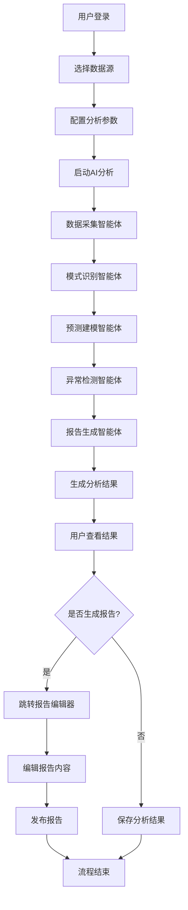
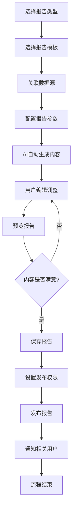
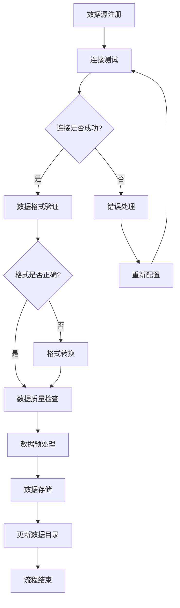
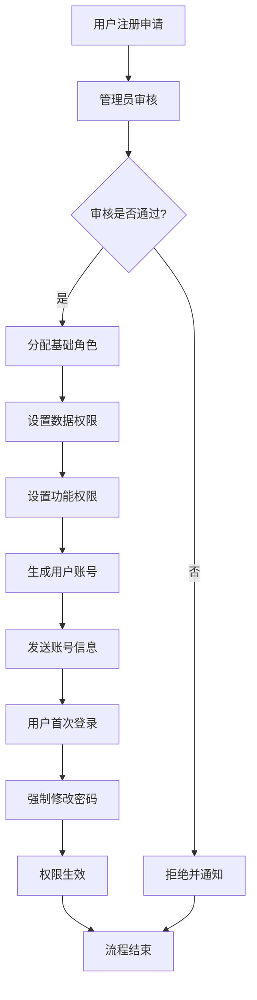
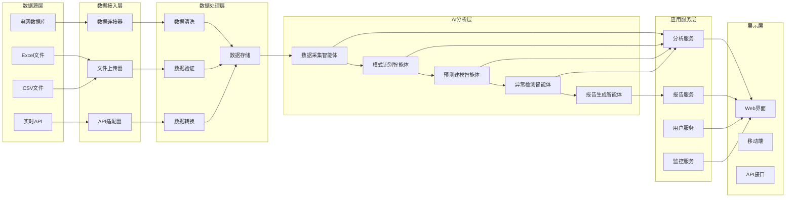

# 山西电网智能报告系统 - 业务架构文档

## 1. 业务架构概述

### 1.1 业务架构目标
构建一个以AI驱动的智能化电网数据分析与报告生成平台，实现从数据采集到报告发布的全流程自动化业务处理。

### 1.2 业务架构原则
- **数据驱动**: 以数据为核心，通过AI分析提供业务洞察
- **流程标准化**: 建立标准化的分析和报告生成流程
- **智能协作**: 多智能体协同工作，提高分析效率和质量
- **用户中心**: 以用户需求为导向，提供个性化服务

## 2. 业务域划分

### 2.1 核心业务域

#### 2.1.1 用户管理域
- **职责**: 用户身份认证、权限管理、用户配置
- **主要实体**: 用户、角色、权限、组织
- **关键流程**: 用户注册、登录认证、权限分配

#### 2.1.2 数据管理域
- **职责**: 数据源管理、数据质量控制、数据预处理
- **主要实体**: 数据源、数据集、数据质量规则
- **关键流程**: 数据接入、数据验证、数据清洗

#### 2.1.3 智能分析域
- **职责**: AI模型管理、分析任务执行、结果生成
- **主要实体**: 分析任务、AI模型、分析结果
- **关键流程**: 任务创建、智能体协作、结果输出

#### 2.1.4 报告管理域
- **职责**: 报告模板管理、报告生成、报告发布
- **主要实体**: 报告模板、报告实例、发布配置
- **关键流程**: 模板设计、报告生成、报告分发

### 2.2 支撑业务域

#### 2.2.1 系统监控域
- **职责**: 系统性能监控、智能体状态监控、异常告警
- **主要实体**: 监控指标、告警规则、监控面板

#### 2.2.2 配置管理域
- **职责**: 系统配置、AI模型配置、业务规则配置
- **主要实体**: 配置项、配置版本、配置策略

## 3. 业务流程设计

### 3.1 主业务流程

#### 3.1.1 智能分析流程



**流程说明**:
1. **用户认证**: 验证用户身份和权限
2. **数据准备**: 选择和验证数据源
3. **参数配置**: 设置分析类型和参数
4. **AI协作分析**: 五大智能体协同工作
5. **结果处理**: 生成可视化分析结果
6. **报告生成**: 可选择生成正式报告

#### 3.1.2 报告生成流程



### 3.2 支撑流程

#### 3.2.1 数据接入流程



#### 3.2.2 用户权限管理流程



## 4. 数据流设计

### 4.1 数据流架构



### 4.2 关键数据实体

#### 4.2.1 用户相关实体

```
用户 (User)
├── 用户ID
├── 用户名
├── 邮箱
├── 角色ID
├── 组织ID
├── 创建时间
└── 最后登录时间

角色 (Role)
├── 角色ID
├── 角色名称
├── 角色描述
├── 权限列表
└── 创建时间

权限 (Permission)
├── 权限ID
├── 权限名称
├── 权限类型
├── 资源路径
└── 操作类型
```

#### 4.2.2 数据源相关实体

```
数据源 (DataSource)
├── 数据源ID
├── 数据源名称
├── 数据源类型
├── 连接配置
├── 状态
├── 创建者
└── 更新时间

数据集 (Dataset)
├── 数据集ID
├── 数据源ID
├── 数据集名称
├── 字段定义
├── 数据量
├── 质量评分
└── 最后更新时间
```

#### 4.2.3 分析相关实体

```
分析任务 (AnalysisTask)
├── 任务ID
├── 任务名称
├── 数据源ID
├── 分析类型
├── 参数配置
├── 状态
├── 进度
├── 创建者
├── 开始时间
└── 完成时间

分析结果 (AnalysisResult)
├── 结果ID
├── 任务ID
├── 结果数据
├── 可视化配置
├── 洞察摘要
└── 生成时间
```

#### 4.2.4 报告相关实体

```
报告模板 (ReportTemplate)
├── 模板ID
├── 模板名称
├── 模板类型
├── 模板内容
├── 参数定义
├── 创建者
└── 版本号

报告实例 (ReportInstance)
├── 报告ID
├── 模板ID
├── 报告标题
├── 报告内容
├── 状态
├── 创建者
├── 创建时间
└── 发布时间
```

## 5. 业务规则定义

### 5.1 数据管理规则

#### 5.1.1 数据质量规则
- **完整性检查**: 必填字段不能为空
- **格式验证**: 数据格式必须符合预定义规范
- **范围检查**: 数值数据必须在合理范围内
- **一致性检查**: 关联数据必须保持一致
- **时效性检查**: 数据时间戳必须在有效期内

#### 5.1.2 数据安全规则
- **访问控制**: 基于角色的数据访问权限
- **数据脱敏**: 敏感数据自动脱敏处理
- **审计日志**: 所有数据操作必须记录日志
- **备份策略**: 重要数据定期自动备份

### 5.2 分析业务规则

#### 5.2.1 任务执行规则
- **并发限制**: 单用户最多同时执行3个分析任务
- **资源限制**: 大数据量分析任务需要预约执行
- **超时控制**: 分析任务最长执行时间30分钟
- **优先级**: VIP用户任务优先执行

#### 5.2.2 结果处理规则
- **结果保留**: 分析结果默认保留30天
- **共享权限**: 结果创建者可设置共享权限
- **版本管理**: 重复分析自动创建新版本
- **异常处理**: 分析失败自动重试3次

### 5.3 报告管理规则

#### 5.3.1 模板管理规则
- **版本控制**: 模板修改自动创建新版本
- **审核流程**: 公共模板需要管理员审核
- **使用统计**: 记录模板使用频次和评价
- **权限控制**: 模板创建者拥有完全控制权

#### 5.3.2 报告发布规则
- **审核机制**: 重要报告需要上级审核
- **发布权限**: 基于角色的发布权限控制
- **版本管理**: 报告修改后自动创建新版本
- **通知机制**: 报告发布后自动通知相关人员

## 6. 业务异常处理

### 6.1 数据异常处理

#### 6.1.1 数据源异常
- **连接失败**: 自动重试 → 降级处理 → 人工介入
- **数据格式错误**: 格式转换 → 错误提示 → 手动修正
- **数据缺失**: 使用历史数据 → 插值处理 → 标记缺失

#### 6.1.2 数据质量异常
- **数据异常值**: 异常标记 → 人工确认 → 处理决策
- **数据不一致**: 冲突检测 → 规则匹配 → 自动修正

### 6.2 分析异常处理

#### 6.2.1 AI服务异常
- **API调用失败**: 重试机制 → 切换服务 → 降级处理
- **模型响应超时**: 任务重启 → 资源调整 → 人工介入
- **结果异常**: 结果验证 → 重新分析 → 专家审核

#### 6.2.2 系统资源异常
- **内存不足**: 任务暂停 → 资源释放 → 分批处理
- **存储空间不足**: 清理临时文件 → 压缩数据 → 扩容处理

### 6.3 用户操作异常

#### 6.3.1 权限异常
- **无权限访问**: 权限检查 → 错误提示 → 申请流程
- **会话过期**: 自动续期 → 重新登录 → 状态恢复

#### 6.3.2 操作异常
- **并发冲突**: 乐观锁 → 冲突检测 → 合并处理
- **操作超时**: 进度保存 → 断点续传 → 状态恢复

## 7. 业务监控指标

### 7.1 业务健康度指标

#### 7.1.1 用户活跃度
- **日活跃用户数** (DAU)
- **月活跃用户数** (MAU)
- **用户留存率**
- **功能使用率**

#### 7.1.2 系统性能指标
- **分析任务成功率** (>95%)
- **平均响应时间** (<3秒)
- **系统可用性** (>99.9%)
- **并发处理能力** (100+用户)

#### 7.1.3 业务价值指标
- **报告生成效率提升** (目标80%)
- **数据分析准确率** (>95%)
- **用户满意度** (NPS>8.0)
- **成本节约比例** (目标60%)

### 7.2 告警规则

#### 7.2.1 系统告警
- **系统可用性** < 99%
- **响应时间** > 5秒
- **错误率** > 1%
- **资源使用率** > 80%

#### 7.2.2 业务告警
- **分析任务失败率** > 5%
- **数据质量评分** < 80%
- **用户投诉数量** > 5/天
- **AI服务调用失败率** > 2%

## 8. 业务连续性保障

### 8.1 灾难恢复策略

#### 8.1.1 数据备份策略
- **实时备份**: 关键业务数据实时同步
- **定期备份**: 全量数据每日备份
- **异地备份**: 重要数据异地存储
- **备份验证**: 定期验证备份完整性

#### 8.1.2 服务恢复策略
- **故障检测**: 自动故障检测和告警
- **快速切换**: 主备服务自动切换
- **数据恢复**: 快速数据恢复机制
- **服务验证**: 恢复后服务功能验证

### 8.2 业务降级策略

#### 8.2.1 功能降级
- **AI分析降级**: 使用简化算法或历史模型
- **报告生成降级**: 使用基础模板和静态数据
- **实时监控降级**: 延长监控间隔或采样监控

#### 8.2.2 性能降级
- **并发限制**: 限制同时在线用户数
- **功能限制**: 暂停非核心功能
- **资源调配**: 优先保障核心业务资源

---

**文档版本**: v1.0  
**创建日期**: 2024年1月  
**更新日期**: 2024年1月  
**负责人**: 业务架构师  
**审核人**: 技术负责人、产品负责人