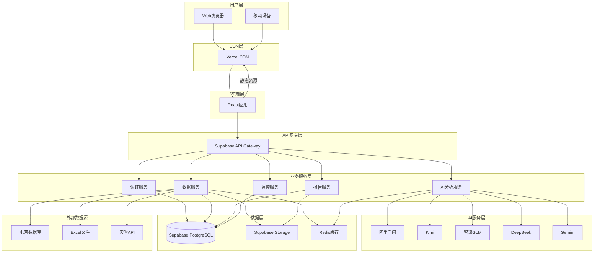

# 山西电网智能报告系统 - 技术架构文档

## 1. 技术架构概述

### 1.1 架构设计原则
- **微服务架构**: 模块化设计，服务独立部署
- **云原生**: 基于云平台，支持弹性扩缩容
- **高可用**: 多层容错机制，保障系统稳定性
- **安全优先**: 多层安全防护，保护数据安全
- **性能优化**: 缓存策略和异步处理提升性能

### 1.2 技术栈选择

#### 1.2.1 前端技术栈
- **框架**: React 18 + TypeScript
- **构建工具**: Vite
- **UI组件库**: Ant Design
- **状态管理**: React Context + Hooks
- **路由**: React Router v6
- **动画**: Framer Motion
- **样式**: Tailwind CSS + CSS Modules

#### 1.2.2 后端技术栈
- **数据库**: Supabase (PostgreSQL)
- **认证**: Supabase Auth
- **API**: Supabase REST API + Edge Functions
- **文件存储**: Supabase Storage
- **实时通信**: Supabase Realtime

#### 1.2.3 AI服务集成
- **阿里千问**: 通义千问API
- **Kimi**: Moonshot AI API
- **智谱**: GLM API
- **DeepSeek**: DeepSeek API
- **Gemini**: Google Gemini API

#### 1.2.4 部署与运维
- **容器化**: Docker
- **部署平台**: Vercel (前端) + Supabase (后端)
- **监控**: Supabase Analytics + 自定义监控
- **日志**: Supabase Logs

## 2. 系统架构设计

### 2.1 整体架构图



### 2.2 服务架构设计

#### 2.2.1 认证服务 (Auth Service)
- **职责**: 用户认证、授权、会话管理
- **技术实现**: Supabase Auth + JWT
- **关键功能**:
  - 用户注册/登录
  - 多因素认证
  - 角色权限管理
  - 会话状态管理

#### 2.2.2 数据服务 (Data Service)
- **职责**: 数据源管理、数据处理、数据存储
- **技术实现**: Supabase Edge Functions + PostgreSQL
- **关键功能**:
  - 数据源连接管理
  - 数据质量检查
  - 数据预处理
  - 数据存储优化

#### 2.2.3 AI分析服务 (AI Analysis Service)
- **职责**: AI模型调用、分析任务管理、结果处理
- **技术实现**: Edge Functions + 多AI API集成
- **关键功能**:
  - 智能体协作调度
  - AI API负载均衡
  - 分析任务队列
  - 结果缓存优化

#### 2.2.4 报告服务 (Report Service)
- **职责**: 报告模板管理、报告生成、报告发布
- **技术实现**: Edge Functions + 模板引擎
- **关键功能**:
  - 模板渲染引擎
  - 报告版本管理
  - 多格式导出
  - 权限控制

## 3. 数据库设计

### 3.1 数据库架构

#### 3.1.1 核心表结构

```sql
-- 用户表
CREATE TABLE users (
    id UUID PRIMARY KEY DEFAULT gen_random_uuid(),
    email VARCHAR(255) UNIQUE NOT NULL,
    username VARCHAR(100) UNIQUE NOT NULL,
    full_name VARCHAR(200),
    avatar_url TEXT,
    role_id UUID REFERENCES roles(id),
    organization_id UUID REFERENCES organizations(id),
    is_active BOOLEAN DEFAULT true,
    created_at TIMESTAMP WITH TIME ZONE DEFAULT NOW(),
    updated_at TIMESTAMP WITH TIME ZONE DEFAULT NOW()
);

-- 角色表
CREATE TABLE roles (
    id UUID PRIMARY KEY DEFAULT gen_random_uuid(),
    name VARCHAR(100) UNIQUE NOT NULL,
    description TEXT,
    permissions JSONB,
    created_at TIMESTAMP WITH TIME ZONE DEFAULT NOW()
);

-- 组织表
CREATE TABLE organizations (
    id UUID PRIMARY KEY DEFAULT gen_random_uuid(),
    name VARCHAR(200) NOT NULL,
    description TEXT,
    parent_id UUID REFERENCES organizations(id),
    created_at TIMESTAMP WITH TIME ZONE DEFAULT NOW()
);

-- 数据源表
CREATE TABLE data_sources (
    id UUID PRIMARY KEY DEFAULT gen_random_uuid(),
    name VARCHAR(200) NOT NULL,
    type VARCHAR(50) NOT NULL, -- 'database', 'file', 'api'
    connection_config JSONB,
    status VARCHAR(20) DEFAULT 'active', -- 'active', 'inactive', 'error'
    owner_id UUID REFERENCES users(id),
    created_at TIMESTAMP WITH TIME ZONE DEFAULT NOW(),
    updated_at TIMESTAMP WITH TIME ZONE DEFAULT NOW()
);

-- 数据集表
CREATE TABLE datasets (
    id UUID PRIMARY KEY DEFAULT gen_random_uuid(),
    data_source_id UUID REFERENCES data_sources(id),
    name VARCHAR(200) NOT NULL,
    schema_definition JSONB,
    row_count BIGINT,
    size_bytes BIGINT,
    quality_score DECIMAL(3,2),
    last_updated TIMESTAMP WITH TIME ZONE,
    created_at TIMESTAMP WITH TIME ZONE DEFAULT NOW()
);

-- 分析任务表
CREATE TABLE analysis_tasks (
    id UUID PRIMARY KEY DEFAULT gen_random_uuid(),
    name VARCHAR(200) NOT NULL,
    description TEXT,
    data_source_id UUID REFERENCES data_sources(id),
    analysis_type VARCHAR(50) NOT NULL,
    parameters JSONB,
    status VARCHAR(20) DEFAULT 'pending', -- 'pending', 'running', 'completed', 'failed'
    progress INTEGER DEFAULT 0,
    owner_id UUID REFERENCES users(id),
    started_at TIMESTAMP WITH TIME ZONE,
    completed_at TIMESTAMP WITH TIME ZONE,
    created_at TIMESTAMP WITH TIME ZONE DEFAULT NOW()
);

-- 分析结果表
CREATE TABLE analysis_results (
    id UUID PRIMARY KEY DEFAULT gen_random_uuid(),
    task_id UUID REFERENCES analysis_tasks(id),
    result_data JSONB,
    insights JSONB,
    visualizations JSONB,
    confidence_score DECIMAL(3,2),
    created_at TIMESTAMP WITH TIME ZONE DEFAULT NOW()
);

-- 报告模板表
CREATE TABLE report_templates (
    id UUID PRIMARY KEY DEFAULT gen_random_uuid(),
    name VARCHAR(200) NOT NULL,
    description TEXT,
    template_type VARCHAR(50),
    content JSONB,
    parameters JSONB,
    is_public BOOLEAN DEFAULT false,
    owner_id UUID REFERENCES users(id),
    version INTEGER DEFAULT 1,
    created_at TIMESTAMP WITH TIME ZONE DEFAULT NOW(),
    updated_at TIMESTAMP WITH TIME ZONE DEFAULT NOW()
);

-- 报告实例表
CREATE TABLE reports (
    id UUID PRIMARY KEY DEFAULT gen_random_uuid(),
    template_id UUID REFERENCES report_templates(id),
    title VARCHAR(300) NOT NULL,
    content JSONB,
    status VARCHAR(20) DEFAULT 'draft', -- 'draft', 'published', 'archived'
    owner_id UUID REFERENCES users(id),
    published_at TIMESTAMP WITH TIME ZONE,
    created_at TIMESTAMP WITH TIME ZONE DEFAULT NOW(),
    updated_at TIMESTAMP WITH TIME ZONE DEFAULT NOW()
);

-- AI配置表
CREATE TABLE ai_configs (
    id UUID PRIMARY KEY DEFAULT gen_random_uuid(),
    provider VARCHAR(50) NOT NULL, -- 'qwen', 'kimi', 'zhipu', 'deepseek', 'gemini'
    api_key_encrypted TEXT NOT NULL,
    endpoint_url TEXT,
    model_name VARCHAR(100),
    parameters JSONB,
    is_active BOOLEAN DEFAULT true,
    priority INTEGER DEFAULT 1,
    created_at TIMESTAMP WITH TIME ZONE DEFAULT NOW(),
    updated_at TIMESTAMP WITH TIME ZONE DEFAULT NOW()
);

-- 系统日志表
CREATE TABLE system_logs (
    id UUID PRIMARY KEY DEFAULT gen_random_uuid(),
    level VARCHAR(20) NOT NULL, -- 'info', 'warn', 'error', 'debug'
    service VARCHAR(50),
    message TEXT,
    metadata JSONB,
    user_id UUID REFERENCES users(id),
    created_at TIMESTAMP WITH TIME ZONE DEFAULT NOW()
);
```

#### 3.1.2 索引设计

```sql
-- 性能优化索引
CREATE INDEX idx_users_email ON users(email);
CREATE INDEX idx_users_role_org ON users(role_id, organization_id);
CREATE INDEX idx_data_sources_owner ON data_sources(owner_id);
CREATE INDEX idx_data_sources_type_status ON data_sources(type, status);
CREATE INDEX idx_analysis_tasks_owner_status ON analysis_tasks(owner_id, status);
CREATE INDEX idx_analysis_tasks_created_at ON analysis_tasks(created_at DESC);
CREATE INDEX idx_reports_owner_status ON reports(owner_id, status);
CREATE INDEX idx_system_logs_level_created ON system_logs(level, created_at DESC);

-- 全文搜索索引
CREATE INDEX idx_reports_title_search ON reports USING gin(to_tsvector('english', title));
CREATE INDEX idx_templates_name_search ON report_templates USING gin(to_tsvector('english', name));
```

### 3.2 数据安全设计

#### 3.2.1 行级安全策略 (RLS)

```sql
-- 启用行级安全
ALTER TABLE users ENABLE ROW LEVEL SECURITY;
ALTER TABLE data_sources ENABLE ROW LEVEL SECURITY;
ALTER TABLE analysis_tasks ENABLE ROW LEVEL SECURITY;
ALTER TABLE reports ENABLE ROW LEVEL SECURITY;

-- 用户只能访问自己的数据
CREATE POLICY "Users can view own profile" ON users
    FOR SELECT USING (auth.uid() = id);

CREATE POLICY "Users can update own profile" ON users
    FOR UPDATE USING (auth.uid() = id);

-- 数据源访问策略
CREATE POLICY "Users can view own data sources" ON data_sources
    FOR SELECT USING (owner_id = auth.uid());

CREATE POLICY "Users can manage own data sources" ON data_sources
    FOR ALL USING (owner_id = auth.uid());

-- 分析任务访问策略
CREATE POLICY "Users can view own analysis tasks" ON analysis_tasks
    FOR SELECT USING (owner_id = auth.uid());

CREATE POLICY "Users can manage own analysis tasks" ON analysis_tasks
    FOR ALL USING (owner_id = auth.uid());

-- 报告访问策略
CREATE POLICY "Users can view accessible reports" ON reports
    FOR SELECT USING (
        owner_id = auth.uid() OR 
        status = 'published'
    );

CREATE POLICY "Users can manage own reports" ON reports
    FOR ALL USING (owner_id = auth.uid());
```

#### 3.2.2 数据加密

```sql
-- 创建加密函数
CREATE OR REPLACE FUNCTION encrypt_api_key(api_key TEXT)
RETURNS TEXT AS $$
BEGIN
    RETURN encode(encrypt(api_key::bytea, 'encryption_key', 'aes'), 'base64');
END;
$$ LANGUAGE plpgsql SECURITY DEFINER;

CREATE OR REPLACE FUNCTION decrypt_api_key(encrypted_key TEXT)
RETURNS TEXT AS $$
BEGIN
    RETURN convert_from(decrypt(decode(encrypted_key, 'base64'), 'encryption_key', 'aes'), 'UTF8');
END;
$$ LANGUAGE plpgsql SECURITY DEFINER;
```

## 4. API设计规范

### 4.1 RESTful API设计

#### 4.1.1 API基础规范

```
基础URL: https://your-project.supabase.co/rest/v1/
认证方式: Bearer Token (JWT)
内容类型: application/json
字符编码: UTF-8
```

#### 4.1.2 响应格式标准

```json
// 成功响应
{
  "success": true,
  "data": {
    // 响应数据
  },
  "message": "操作成功",
  "timestamp": "2024-01-15T10:30:00Z"
}

// 错误响应
{
  "success": false,
  "error": {
    "code": "VALIDATION_ERROR",
    "message": "参数验证失败",
    "details": {
      "field": "email",
      "reason": "邮箱格式不正确"
    }
  },
  "timestamp": "2024-01-15T10:30:00Z"
}
```

#### 4.1.3 核心API端点

##### 用户管理API

```
# 用户认证
POST /auth/signup          # 用户注册
POST /auth/signin          # 用户登录
POST /auth/signout         # 用户登出
POST /auth/refresh         # 刷新令牌
POST /auth/reset-password  # 重置密码

# 用户信息
GET    /users/profile      # 获取用户信息
PUT    /users/profile      # 更新用户信息
GET    /users/permissions  # 获取用户权限
```

##### 数据源管理API

```
# 数据源CRUD
GET    /data-sources           # 获取数据源列表
POST   /data-sources           # 创建数据源
GET    /data-sources/{id}      # 获取数据源详情
PUT    /data-sources/{id}      # 更新数据源
DELETE /data-sources/{id}      # 删除数据源

# 数据源操作
POST   /data-sources/{id}/test-connection  # 测试连接
GET    /data-sources/{id}/schema           # 获取数据结构
POST   /data-sources/{id}/preview          # 预览数据
POST   /data-sources/upload               # 文件上传
```

##### AI分析API

```
# 分析任务
GET    /analysis/tasks        # 获取分析任务列表
POST   /analysis/tasks        # 创建分析任务
GET    /analysis/tasks/{id}   # 获取任务详情
PUT    /analysis/tasks/{id}   # 更新任务
DELETE /analysis/tasks/{id}   # 删除任务

# 任务执行
POST   /analysis/tasks/{id}/start   # 启动分析
POST   /analysis/tasks/{id}/stop    # 停止分析
GET    /analysis/tasks/{id}/status  # 获取执行状态
GET    /analysis/tasks/{id}/result  # 获取分析结果

# AI服务
GET    /analysis/ai-services        # 获取AI服务状态
POST   /analysis/ai-services/test   # 测试AI服务
```

##### 报告管理API

```
# 报告模板
GET    /reports/templates        # 获取模板列表
POST   /reports/templates        # 创建模板
GET    /reports/templates/{id}   # 获取模板详情
PUT    /reports/templates/{id}   # 更新模板
DELETE /reports/templates/{id}   # 删除模板

# 报告实例
GET    /reports               # 获取报告列表
POST   /reports               # 创建报告
GET    /reports/{id}          # 获取报告详情
PUT    /reports/{id}          # 更新报告
DELETE /reports/{id}          # 删除报告

# 报告操作
POST   /reports/{id}/publish    # 发布报告
POST   /reports/{id}/export     # 导出报告
GET    /reports/{id}/versions   # 获取版本历史
```

### 4.2 Edge Functions设计

#### 4.2.1 AI分析函数

```typescript
// supabase/functions/ai-analysis/index.ts
import { serve } from 'https://deno.land/std@0.168.0/http/server.ts'
import { createClient } from 'https://esm.sh/@supabase/supabase-js@2'

interface AnalysisRequest {
  taskId: string
  dataSourceId: string
  analysisType: string
  parameters: Record<string, any>
}

serve(async (req) => {
  try {
    const { taskId, dataSourceId, analysisType, parameters }: AnalysisRequest = await req.json()
    
    // 获取数据
    const data = await fetchDataFromSource(dataSourceId)
    
    // AI分析流程
    const analysisResult = await performAIAnalysis({
      data,
      type: analysisType,
      parameters
    })
    
    // 保存结果
    await saveAnalysisResult(taskId, analysisResult)
    
    return new Response(
      JSON.stringify({ success: true, result: analysisResult }),
      { headers: { 'Content-Type': 'application/json' } }
    )
  } catch (error) {
    return new Response(
      JSON.stringify({ success: false, error: error.message }),
      { status: 500, headers: { 'Content-Type': 'application/json' } }
    )
  }
})

async function performAIAnalysis(config: any) {
  // 智能体协作分析逻辑
  const agents = [
    new DataCollectionAgent(),
    new PatternRecognitionAgent(),
    new PredictiveModelingAgent(),
    new AnomalyDetectionAgent(),
    new ReportGenerationAgent()
  ]
  
  let result = config.data
  for (const agent of agents) {
    result = await agent.process(result, config.parameters)
  }
  
  return result
}
```

#### 4.2.2 报告生成函数

```typescript
// supabase/functions/report-generation/index.ts
import { serve } from 'https://deno.land/std@0.168.0/http/server.ts'

interface ReportRequest {
  templateId: string
  data: Record<string, any>
  format: 'html' | 'pdf' | 'docx'
}

serve(async (req) => {
  try {
    const { templateId, data, format }: ReportRequest = await req.json()
    
    // 获取模板
    const template = await getReportTemplate(templateId)
    
    // 渲染报告
    const report = await renderReport(template, data)
    
    // 格式转换
    const output = await convertFormat(report, format)
    
    return new Response(output, {
      headers: {
        'Content-Type': getContentType(format),
        'Content-Disposition': `attachment; filename="report.${format}"`
      }
    })
  } catch (error) {
    return new Response(
      JSON.stringify({ success: false, error: error.message }),
      { status: 500, headers: { 'Content-Type': 'application/json' } }
    )
  }
})
```

## 5. AI服务集成架构

### 5.1 AI服务抽象层

```typescript
// src/services/ai/AIServiceManager.ts
export interface AIProvider {
  name: string
  endpoint: string
  apiKey: string
  model: string
  priority: number
  isActive: boolean
}

export interface AIRequest {
  prompt: string
  context?: string
  parameters?: Record<string, any>
}

export interface AIResponse {
  content: string
  usage: {
    promptTokens: number
    completionTokens: number
    totalTokens: number
  }
  model: string
  provider: string
}

export class AIServiceManager {
  private providers: AIProvider[] = []
  private loadBalancer: LoadBalancer
  private fallbackManager: FallbackManager
  
  constructor() {
    this.loadBalancer = new LoadBalancer()
    this.fallbackManager = new FallbackManager()
    this.initializeProviders()
  }
  
  async callAI(request: AIRequest): Promise<AIResponse> {
    const provider = this.loadBalancer.selectProvider(this.providers)
    
    try {
      return await this.makeRequest(provider, request)
    } catch (error) {
      return await this.fallbackManager.handleFailure(provider, request, this.providers)
    }
  }
  
  private async makeRequest(provider: AIProvider, request: AIRequest): Promise<AIResponse> {
    switch (provider.name) {
      case 'qwen':
        return await this.callQwen(provider, request)
      case 'kimi':
        return await this.callKimi(provider, request)
      case 'zhipu':
        return await this.callZhipu(provider, request)
      case 'deepseek':
        return await this.callDeepSeek(provider, request)
      case 'gemini':
        return await this.callGemini(provider, request)
      default:
        throw new Error(`Unsupported provider: ${provider.name}`)
    }
  }
}
```

### 5.2 负载均衡策略

```typescript
// src/services/ai/LoadBalancer.ts
export class LoadBalancer {
  private requestCounts: Map<string, number> = new Map()
  private lastUsed: Map<string, number> = new Map()
  
  selectProvider(providers: AIProvider[]): AIProvider {
    const activeProviders = providers.filter(p => p.isActive)
    
    if (activeProviders.length === 0) {
      throw new Error('No active AI providers available')
    }
    
    // 优先级 + 轮询策略
    const highPriorityProviders = activeProviders.filter(p => p.priority === 1)
    
    if (highPriorityProviders.length > 0) {
      return this.roundRobin(highPriorityProviders)
    }
    
    return this.roundRobin(activeProviders)
  }
  
  private roundRobin(providers: AIProvider[]): AIProvider {
    // 选择最少使用的提供商
    return providers.reduce((least, current) => {
      const leastCount = this.requestCounts.get(least.name) || 0
      const currentCount = this.requestCounts.get(current.name) || 0
      return currentCount < leastCount ? current : least
    })
  }
}
```

### 5.3 智能体协作框架

```typescript
// src/services/ai/AgentFramework.ts
export abstract class Agent {
  abstract name: string
  abstract description: string
  
  abstract async process(data: any, context: any): Promise<any>
  
  protected async callAI(prompt: string, context?: string): Promise<string> {
    const aiManager = new AIServiceManager()
    const response = await aiManager.callAI({ prompt, context })
    return response.content
  }
}

export class DataCollectionAgent extends Agent {
  name = '数据采集智能体'
  description = '负责数据获取、清洗和预处理'
  
  async process(data: any, context: any): Promise<any> {
    // 数据清洗逻辑
    const cleanedData = await this.cleanData(data)
    
    // AI辅助数据质量评估
    const qualityPrompt = `请评估以下数据的质量：${JSON.stringify(cleanedData.sample)}`
    const qualityAssessment = await this.callAI(qualityPrompt)
    
    return {
      ...cleanedData,
      qualityScore: this.parseQualityScore(qualityAssessment),
      processingInfo: {
        agent: this.name,
        timestamp: new Date().toISOString(),
        recordsProcessed: cleanedData.records.length
      }
    }
  }
  
  private async cleanData(data: any): Promise<any> {
    // 数据清洗实现
    return data
  }
  
  private parseQualityScore(assessment: string): number {
    // 解析AI评估结果
    return 0.95
  }
}

export class PatternRecognitionAgent extends Agent {
  name = '模式识别智能体'
  description = '识别数据中的模式和趋势'
  
  async process(data: any, context: any): Promise<any> {
    const patterns = await this.identifyPatterns(data)
    
    const patternPrompt = `
      基于以下数据模式，请分析主要趋势：
      ${JSON.stringify(patterns)}
    `
    
    const trendAnalysis = await this.callAI(patternPrompt)
    
    return {
      ...data,
      patterns,
      trendAnalysis,
      processingInfo: {
        agent: this.name,
        timestamp: new Date().toISOString(),
        patternsFound: patterns.length
      }
    }
  }
  
  private async identifyPatterns(data: any): Promise<any[]> {
    // 模式识别算法
    return []
  }
}

// 其他智能体类似实现...

export class AgentOrchestrator {
  private agents: Agent[] = [
    new DataCollectionAgent(),
    new PatternRecognitionAgent(),
    new PredictiveModelingAgent(),
    new AnomalyDetectionAgent(),
    new ReportGenerationAgent()
  ]
  
  async executeAnalysis(data: any, context: any): Promise<any> {
    let result = data
    
    for (const agent of this.agents) {
      console.log(`执行 ${agent.name}...`)
      result = await agent.process(result, context)
      
      // 更新进度
      await this.updateProgress(context.taskId, agent.name)
    }
    
    return result
  }
  
  private async updateProgress(taskId: string, agentName: string): Promise<void> {
    // 更新任务进度
  }
}
```

## 6. 安全架构设计

### 6.1 认证与授权

#### 6.1.1 JWT令牌设计

```json
{
  "header": {
    "alg": "HS256",
    "typ": "JWT"
  },
  "payload": {
    "sub": "user-uuid",
    "email": "user@example.com",
    "role": "analyst",
    "org_id": "org-uuid",
    "permissions": [
      "data:read",
      "analysis:create",
      "report:edit"
    ],
    "iat": 1642234567,
    "exp": 1642320967
  }
}
```

#### 6.1.2 权限控制矩阵

| 角色 | 数据源管理 | AI分析 | 报告编辑 | 用户管理 | 系统配置 |
|------|------------|--------|----------|----------|----------|
| 管理员 | ✅ | ✅ | ✅ | ✅ | ✅ |
| 分析师 | ✅ | ✅ | ✅ | ❌ | ❌ |
| 查看者 | 👁️ | 👁️ | 👁️ | ❌ | ❌ |
| 访客 | ❌ | ❌ | 👁️ | ❌ | ❌ |

### 6.2 数据安全

#### 6.2.1 敏感数据处理

```typescript
// src/utils/security.ts
export class DataSecurity {
  // 数据脱敏
  static maskSensitiveData(data: any, fields: string[]): any {
    const masked = { ...data }
    
    fields.forEach(field => {
      if (masked[field]) {
        masked[field] = this.maskValue(masked[field])
      }
    })
    
    return masked
  }
  
  private static maskValue(value: string): string {
    if (value.length <= 4) return '***'
    return value.substring(0, 2) + '*'.repeat(value.length - 4) + value.substring(value.length - 2)
  }
  
  // API密钥加密
  static encryptApiKey(apiKey: string): string {
    // 使用环境变量中的密钥进行加密
    return encrypt(apiKey, process.env.ENCRYPTION_KEY!)
  }
  
  static decryptApiKey(encryptedKey: string): string {
    return decrypt(encryptedKey, process.env.ENCRYPTION_KEY!)
  }
}
```

### 6.3 API安全

#### 6.3.1 请求限流

```typescript
// src/middleware/rateLimit.ts
export class RateLimiter {
  private static requests: Map<string, number[]> = new Map()
  
  static checkLimit(userId: string, limit: number = 100, window: number = 3600): boolean {
    const now = Date.now()
    const userRequests = this.requests.get(userId) || []
    
    // 清理过期请求
    const validRequests = userRequests.filter(time => now - time < window * 1000)
    
    if (validRequests.length >= limit) {
      return false
    }
    
    validRequests.push(now)
    this.requests.set(userId, validRequests)
    
    return true
  }
}
```

## 7. 性能优化策略

### 7.1 缓存策略

#### 7.1.1 多层缓存架构

```typescript
// src/services/cache/CacheManager.ts
export class CacheManager {
  private memoryCache: Map<string, any> = new Map()
  private redisClient: any // Redis客户端
  
  async get(key: string): Promise<any> {
    // L1: 内存缓存
    if (this.memoryCache.has(key)) {
      return this.memoryCache.get(key)
    }
    
    // L2: Redis缓存
    const redisValue = await this.redisClient.get(key)
    if (redisValue) {
      const parsed = JSON.parse(redisValue)
      this.memoryCache.set(key, parsed)
      return parsed
    }
    
    return null
  }
  
  async set(key: string, value: any, ttl: number = 3600): Promise<void> {
    // 设置内存缓存
    this.memoryCache.set(key, value)
    
    // 设置Redis缓存
    await this.redisClient.setex(key, ttl, JSON.stringify(value))
  }
}
```

### 7.2 数据库优化

#### 7.2.1 查询优化

```sql
-- 分页查询优化
CREATE OR REPLACE FUNCTION get_analysis_tasks_paginated(
    user_id UUID,
    page_size INTEGER DEFAULT 20,
    page_offset INTEGER DEFAULT 0
)
RETURNS TABLE (
    id UUID,
    name VARCHAR,
    status VARCHAR,
    created_at TIMESTAMP WITH TIME ZONE,
    total_count BIGINT
) AS $$
BEGIN
    RETURN QUERY
    SELECT 
        t.id,
        t.name,
        t.status,
        t.created_at,
        COUNT(*) OVER() as total_count
    FROM analysis_tasks t
    WHERE t.owner_id = user_id
    ORDER BY t.created_at DESC
    LIMIT page_size
    OFFSET page_offset;
END;
$$ LANGUAGE plpgsql;
```

### 7.3 前端性能优化

#### 7.3.1 代码分割

```typescript
// src/router/index.tsx
import { lazy, Suspense } from 'react'
import { createBrowserRouter } from 'react-router-dom'

// 懒加载组件
const Dashboard = lazy(() => import('../pages/Dashboard'))
const AIAnalysis = lazy(() => import('../pages/AIAnalysis'))
const ReportEditor = lazy(() => import('../pages/ReportEditor'))

export const router = createBrowserRouter([
  {
    path: '/',
    element: (
      <Suspense fallback={<div>Loading...</div>}>
        <MainLayout />
      </Suspense>
    ),
    children: [
      {
        path: 'dashboard',
        element: (
          <Suspense fallback={<div>Loading Dashboard...</div>}>
            <Dashboard />
          </Suspense>
        )
      }
      // 其他路由...
    ]
  }
])
```

## 8. 监控与运维

### 8.1 系统监控

#### 8.1.1 监控指标

```typescript
// src/services/monitoring/MetricsCollector.ts
export class MetricsCollector {
  private metrics: Map<string, number> = new Map()
  
  // 记录API响应时间
  recordApiResponseTime(endpoint: string, duration: number): void {
    const key = `api.response_time.${endpoint}`
    this.metrics.set(key, duration)
  }
  
  // 记录AI服务调用
  recordAIServiceCall(provider: string, success: boolean): void {
    const successKey = `ai.${provider}.success`
    const failureKey = `ai.${provider}.failure`
    
    if (success) {
      this.incrementCounter(successKey)
    } else {
      this.incrementCounter(failureKey)
    }
  }
  
  // 记录用户活动
  recordUserActivity(userId: string, action: string): void {
    const key = `user.activity.${action}`
    this.incrementCounter(key)
  }
  
  private incrementCounter(key: string): void {
    const current = this.metrics.get(key) || 0
    this.metrics.set(key, current + 1)
  }
}
```

### 8.2 日志管理

#### 8.2.1 结构化日志

```typescript
// src/utils/logger.ts
export class Logger {
  static info(message: string, metadata?: any): void {
    this.log('info', message, metadata)
  }
  
  static warn(message: string, metadata?: any): void {
    this.log('warn', message, metadata)
  }
  
  static error(message: string, error?: Error, metadata?: any): void {
    this.log('error', message, { ...metadata, error: error?.stack })
  }
  
  private static log(level: string, message: string, metadata?: any): void {
    const logEntry = {
      timestamp: new Date().toISOString(),
      level,
      message,
      service: 'smart-report-frontend',
      ...metadata
    }
    
    console.log(JSON.stringify(logEntry))
    
    // 发送到后端日志系统
    this.sendToBackend(logEntry)
  }
  
  private static async sendToBackend(logEntry: any): Promise<void> {
    try {
      await fetch('/api/logs', {
        method: 'POST',
        headers: { 'Content-Type': 'application/json' },
        body: JSON.stringify(logEntry)
      })
    } catch (error) {
      // 静默处理日志发送失败
    }
  }
}
```

## 9. 部署架构

### 9.1 容器化部署

#### 9.1.1 Dockerfile

```dockerfile
# 前端Dockerfile
FROM node:18-alpine AS builder

WORKDIR /app
COPY package*.json ./
RUN npm ci --only=production

COPY . .
RUN npm run build

FROM nginx:alpine
COPY --from=builder /app/dist /usr/share/nginx/html
COPY nginx.conf /etc/nginx/nginx.conf

EXPOSE 80
CMD ["nginx", "-g", "daemon off;"]
```

### 9.2 CI/CD流程

#### 9.2.1 GitHub Actions

```yaml
# .github/workflows/deploy.yml
name: Deploy to Production

on:
  push:
    branches: [main]

jobs:
  deploy:
    runs-on: ubuntu-latest
    
    steps:
    - uses: actions/checkout@v3
    
    - name: Setup Node.js
      uses: actions/setup-node@v3
      with:
        node-version: '18'
        cache: 'npm'
    
    - name: Install dependencies
      run: npm ci
    
    - name: Run tests
      run: npm test
    
    - name: Build application
      run: npm run build
      env:
        VITE_SUPABASE_URL: ${{ secrets.SUPABASE_URL }}
        VITE_SUPABASE_ANON_KEY: ${{ secrets.SUPABASE_ANON_KEY }}
    
    - name: Deploy to Vercel
      uses: vercel/action@v1
      with:
        vercel-token: ${{ secrets.VERCEL_TOKEN }}
        vercel-org-id: ${{ secrets.VERCEL_ORG_ID }}
        vercel-project-id: ${{ secrets.VERCEL_PROJECT_ID }}
```

---

**文档版本**: v1.0  
**创建日期**: 2024年1月  
**更新日期**: 2024年1月  
**负责人**: 技术架构师  
**审核人**: CTO、技术负责人