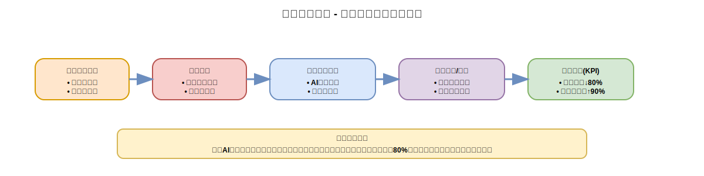
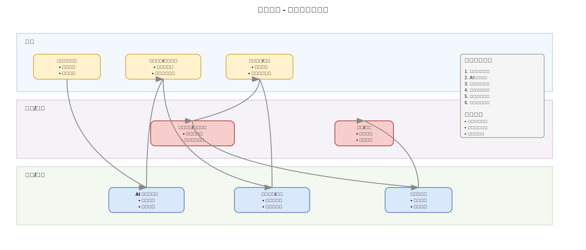
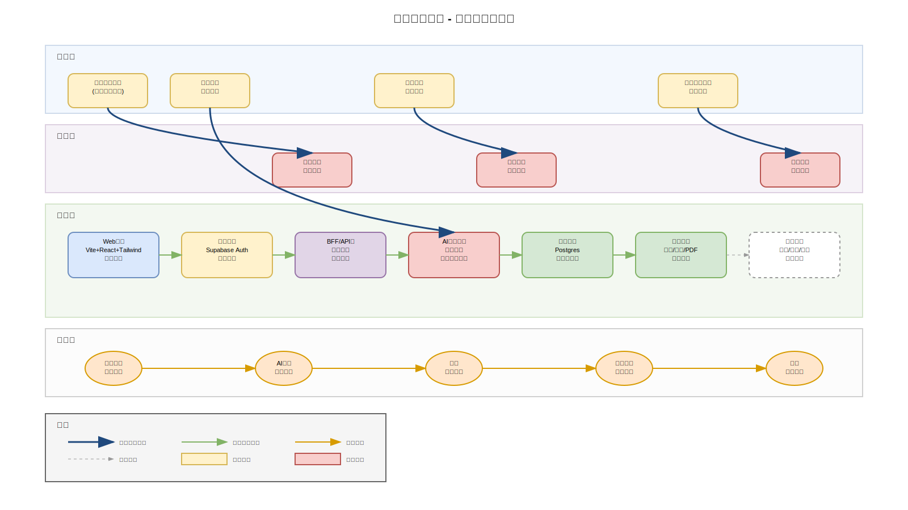

# 智能报告系统 - 产品汇报文档

> **汇报时长**：15-20分钟 | **受众**：业务决策人、技术团队、合作伙伴  
> **核心目标**：展示产品价值、业务流程、技术实现与落地保障

---

## 📋 汇报概览

### 核心价值主张
通过**AI驱动的智能报告系统**，将传统手工报告制作从**数天缩短至数小时**，提升**80%效率**的同时确保内容质量与格式统一。

### 关键成果指标
- 📈 **效率提升**：报告制作时间从3-5天 → 2-4小时
- 🎯 **质量保障**：模板化标准 + AI智能校验
- 👥 **用户满意度**：目标达到90%以上
- 🔄 **复用价值**：模板沉淀 + 知识积累

---

## 🎯 第一部分：产品故事（Why/Who/What/Value）

### 目标用户与核心痛点

#### 目标用户画像
- **业务分析师**：需要定期产出数据分析报告
- **运营管理者**：负责业务总结与汇报材料
- **项目经理**：项目进展与成果展示

#### 当前核心痛点
1. **时间成本高**：手工制作报告耗时3-5天
2. **格式不统一**：缺乏标准化模板与规范
3. **质量不稳定**：依赖个人经验，输出质量参差不齐
4. **重复劳动多**：相似报告重复制作，缺乏复用机制
5. **协作效率低**：多人协作时版本管理混乱

#### 解决方案亮点
- **AI智能分析**：自动数据分析与洞察提取
- **模板化生成**：标准化报告模板与格式
- **协作优化**：多人协作 + 版本管理
- **质量保障**：内容审核 + 规范校验

#### 关键应用场景
- **月度业务报告**：销售、运营、财务等定期汇报
- **项目总结汇报**：项目进展、成果展示、复盘总结
- **数据分析报告**：用户行为、市场趋势、业务洞察
- **管理决策支持**：战略分析、风险评估、投资建议

---

## 🏗️ 第二部分：业务架构（How Business Works）

### 端到端业务流程

#### 关键角色定义
- **用户**：报告需求方，负责需求提出、数据补充、内容确认
- **运营/审核**：质量把关方，负责内容审核、规范校验、发布管理
- **系统/服务**：技术支撑方，提供AI分析、报告生成、审计追溯

#### 业务流程详解

**阶段一：需求启动**
- 用户提出报告需求，明确目标与范围
- 系统进行需求分析与模板匹配推荐

**阶段二：数据处理**
- 用户上传数据源，选择合适的报告模板
- AI引擎进行数据分析与内容智能生成

**阶段三：内容完善**
- 系统生成初版报告草稿
- 用户审阅内容并提供反馈修改意见

**阶段四：质量审核**
- 运营团队进行内容审核与规范校验
- 确保合规性与质量标准

**阶段五：发布归档**
- 系统记录审计追溯信息
- 正式发布报告并进行版本归档

#### 协作亮点
- **人机协作优化**：AI辅助 + 人工校验，效率与质量并重
- **质量闭环管控**：从生成到发布的全流程质量把关
- **全程可追溯**：操作记录、版本管理、审计日志完整保留

---

## 🔧 第三部分：技术架构简版（How It's Built）

### 系统技术架构

#### 架构分层说明

**前端层**
- **技术栈**：Vite + React + TypeScript + Tailwind CSS
- **核心功能**：响应式UI界面、状态管理、路由控制
- **用户体验**：现代化交互设计、移动端适配

**鉴权层**
- **技术选型**：Supabase Auth
- **支持方式**：邮箱登录、第三方OAuth（Google、GitHub）
- **安全保障**：JWT Token管理、会话控制

**业务层（BFF/API）**
- **核心职责**：业务编排、权限校验、审计日志
- **API设计**：RESTful风格、统一响应格式
- **中间件**：请求拦截、参数校验、错误处理

**AI推理层**
- **技术实现**：异步任务队列 + AI推理引擎
- **核心能力**：LLM集成、提示工程、模板渲染
- **性能优化**：批处理、缓存机制、负载均衡

**数据层**
- **结构化存储**：PostgreSQL（用户、项目、报告元数据）
- **对象存储**：AWS S3/阿里云OSS（报告文件、附件、PDF）
- **缓存层**：Redis（会话、临时数据、热点数据）

**可观测性**
- **监控体系**：性能监控、错误追踪、业务指标
- **日志管理**：结构化日志、日志聚合、检索分析
- **告警机制**：阈值监控、异常告警、故障通知

#### 核心技术栈
- **前端**：Vite 5.x + React 18 + TypeScript + Tailwind CSS + Zustand
- **后端**：Node.js + Express/Fastify + Prisma ORM + PostgreSQL + Redis
- **AI/ML**：OpenAI API + LangChain + 模板引擎 + 异步任务队列
- **鉴权**：Supabase Auth + JWT + RBAC权限模型
- **存储**：PostgreSQL + AWS S3/阿里云OSS + 文件CDN
- **运维**：Docker + PM2 + Nginx + 日志聚合 + 性能监控

---

## 🌊 第四部分：综合流程架构

### 端到端系统流程

#### 流程层次说明

**用户层**：用户交互的完整路径
- 需求提出 → 模板选择 → 草稿确认 → 报告获取

**业务层**：业务逻辑的处理流程
- 需求分析 → 内容审核 → 发布归档

**技术层**：技术组件的调用链路
- 前端界面 → 鉴权验证 → API编排 → AI推理 → 数据存储 → 可观测性

**数据层**：数据流转的完整生命周期
- 输入数据 → 分析数据 → 反馈数据 → 导出数据 → 审计数据

---

## 🎯 第五部分：Demo演示路线

### 核心功能演示（5分钟）

#### 演示路径
1. **用户登录**：展示邮箱/第三方登录流程
2. **Dashboard概览**：项目管理、报告列表、模板库
3. **新建报告**：
   - 选择报告类型与模板
   - 上传数据源（Excel、CSV、API）
   - 配置报告参数
4. **AI分析过程**：
   - 数据解析与预处理
   - AI分析进度展示
   - 初版报告生成
5. **内容编辑**：
   - 报告预览与编辑
   - 图表调整与美化
   - 内容补充与修改
6. **导出分享**：
   - 多格式导出（PDF、Word、PPT）
   - 在线分享链接
   - 权限控制设置

#### 亮点展示
- **模板复用**：丰富的行业模板库，一键应用
- **AI智能分析**：自动数据洞察，智能图表推荐
- **协作功能**：多人编辑、评论反馈、版本管理
- **质量保障**：内容审核、格式校验、合规检查

---

## 📊 第六部分：关键指标与计划

### 项目里程碑
- **MVP版本**（已完成）：核心功能开发，基础模板库
- **试点阶段**（进行中）：内部团队试用，功能优化
- **灰度发布**（下月）：部分用户开放，收集反馈
- **全量上线**（下季度）：正式对外发布，规模化推广

### 成功指标（KPI）
- **效率指标**：报告制作时间缩短80%
- **质量指标**：用户满意度达到90%以上
- **使用指标**：月活跃用户数、报告生成量
- **业务指标**：模板复用率、用户留存率

### 风险与应对
- **数据质量风险**：建立数据校验机制，提供数据清洗工具
- **AI准确性风险**：持续优化提示工程，建立人工校验流程
- **性能风险**：异步处理、缓存优化、负载均衡
- **合规风险**：数据脱敏、权限控制、审计日志

---

## ❓ 第七部分：Q&A预案

### 常见问题解答

**Q1：与现有报告流程如何对接？**
A：支持现有数据源导入，提供API接口对接，逐步迁移现有模板。

**Q2：数据安全如何保障？**
A：端到端加密传输，数据脱敏处理，完整审计日志，符合GDPR等合规要求。

**Q3：AI生成内容的准确性如何？**
A：多层校验机制：AI初筛 + 规则校验 + 人工审核，确保内容质量。

**Q4：系统可扩展性如何？**
A：微服务架构，支持水平扩展；模板体系可插拔，支持自定义扩展。

**Q5：成本评估如何？**
A：相比人工成本，预计节省70%时间成本；技术成本主要为AI调用费用，可控制在合理范围。

---

## 🚀 总结与下一步

### 核心价值回顾
- **效率革命**：从数天到数小时的报告制作周期
- **质量保障**：标准化模板 + AI智能校验
- **协作优化**：多人协作 + 版本管理 + 审计追溯
- **知识沉淀**：模板复用 + 经验积累 + 持续优化

### 下一步行动
1. **技术优化**：性能调优、功能完善、用户体验提升
2. **内容建设**：扩充模板库、优化AI模型、增强分析能力
3. **生态建设**：API开放、插件体系、第三方集成
4. **规模推广**：用户培训、案例分享、市场推广

---

**感谢聆听！欢迎提问与交流** 🙏

> 📧 联系方式：[项目邮箱]  
> 🔗 项目地址：[GitHub链接]  
> 📱 在线Demo：[演示地址]